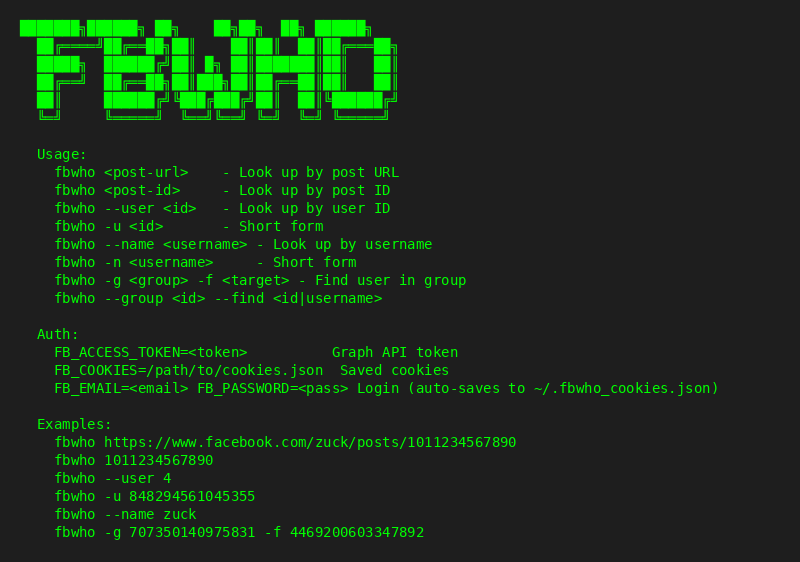
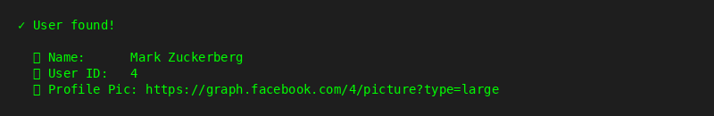
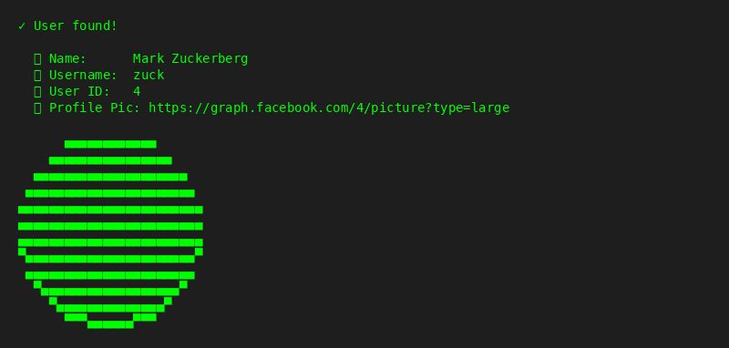
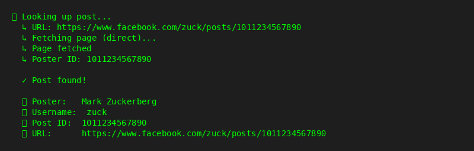
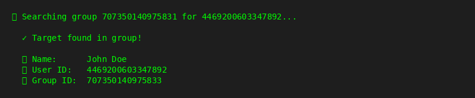

# fbwho

Facebook post lookup tool. Find who posted a Facebook post by URL, post ID, user ID, or username.

## Installation

```bash
git clone https://github.com/zidanebarkat/fbwho-tools.git
cd fbwho-tools
chmod +x fbwho
```

### Dependencies

```bash
pip install requests beautifulsoup4 Pillow
```

Optional (for browser-based fetching):
```bash
pip install playwright
python3 -m playwright install chromium
```

---

## Step 1: View Help

```bash
./fbwho --help
```



```
  ███████╗██████╗ ██╗    ██╗██╗  ██╗ ██████╗
  ██╔════╝██╔══██╗██║    ██║██║  ██║██╔═══██╗
  █████╗  ██████╔╝██║ █╗ ██║███████║██║   ██║
  ██╔══╝  ██╔══██╗██║███╗██║██╔══██║██║   ██║
  ██║     ██████╔╝╚███╔███╔╝██║  ██║╚██████╔╝
  ╚═╝     ╚═════╝  ╚══╝╚══╝ ╚═╝  ╚═╝ ╚═════╝

  Usage:
    fbwho <post-url>    - Look up by post URL
    fbwho <post-id>     - Look up by post ID
    fbwho --user <id>   - Look up by user ID
    fbwho -u <id>       - Short form
    fbwho --name <username> - Look up by username
    fbwho -n <username>     - Short form
    fbwho -g <group> -f <target> - Find user in group
    fbwho --group <id> --find <id|username>

  Auth:
    FB_ACCESS_TOKEN=<token>          Graph API token
    FB_COOKIES=/path/to/cookies.json  Saved cookies
    FB_EMAIL=<email> FB_PASSWORD=<pass> Login (auto-saves to ~/.fbwho_cookies.json)

  Examples:
    fbwho https://www.facebook.com/zuck/posts/1011234567890
    fbwho 1011234567890
    fbwho --user 4
    fbwho -u 848294561045355
    fbwho --name zuck
    fbwho -g 707350140975831 -f 4469200603347892
```

---

## Step 2: Look Up User by ID

```bash
./fbwho --user 4
```



```
  ✓ User found!

  👤 Name:      Mark Zuckerberg
  🆔 User ID:   4
  🖼 Profile Pic: https://graph.facebook.com/4/picture?type=large
```

---

## Step 3: Look Up by Username

```bash
./fbwho --name zuck
```



```
  ✓ User found!

  👤 Name:      Mark Zuckerberg
  🔗 Username:  zuck
  🆔 User ID:   4
  🖼 Profile Pic: https://graph.facebook.com/4/picture?type=large

      ▄▄▄▄▄▄▄▄▄▄▄▄
    ▄▄▄▄▄▄▄▄▄▄▄▄▄▄▄▄
  ▄▄▄▄▄▄▄▄▄▄▄▄▄▄▄▄▄▄▄▄
 ▄▄▄▄▄▄▄▄▄▄▄▄▄▄▄▄▄▄▄▄▄▄
▄▄▄▄▄▄▄▄▄▄▄▄▄▄▄▄▄▄▄▄▄▄▄▄
▄▄▄▄▄▄▄▄▄▄▄▄▄▄▄▄▄▄▄▄▄▄▄▄
▄▄▄▄▄▄▄▄▄▄▄▄▄▄▄▄▄▄▄▄▄▄▄▄
▀▄▄▄▄▄▄▄▄▄▄▄▄▄▄▄▄▄▄▄▄▄▄▀
 ▄▄▄▄▄▄▄▄▄▄▄▄▄▄▄▄▄▄▄▄▄▄
  ▀▄▄▄▄▄▄▄▄▄▄▄▄▄▄▄▄▄▄▀
    ▀▄▄▄▄▄▄▄▄▄▄▄▄▄▄▀
      ▀▀▀▄▄▄▄▄▄▀▀▀
```

---

## Step 4: Look Up Post by URL

```bash
./fbwho https://www.facebook.com/zuck/posts/1011234567890
```



The tool will:
1. Parse the URL and extract the post ID
2. Query the Facebook Graph API (if token is set)
3. Fetch the page HTML
4. Extract poster name, username, and profile pic

---

## Step 5: Authentication Setup

### Option A: Access Token (Recommended)

```bash
export FB_ACCESS_TOKEN=your_token_here
./fbwho --user 4
```

### Option B: Cookies

```bash
export FB_COOKIES=/path/to/cookies.json
./fbwho --user 4
```

### Option C: Auto-Login

```bash
export FB_EMAIL=your@email.com
export FB_PASSWORD=your_password
./fbwho --user 4
```

---

## Step 6: Find User in Group

```bash
./fbwho -g 707350140975831 -f 4469200603347892
```



---

## Features

- Look up Facebook post authors by URL or post ID
- Find users by user ID or username
- Display profile pictures in terminal (ASCII art)
- Support for Graph API, cookies, and browser-based fetching
- Find users within Facebook groups
- RTL text support
- Animated loading screen

## License

MIT
